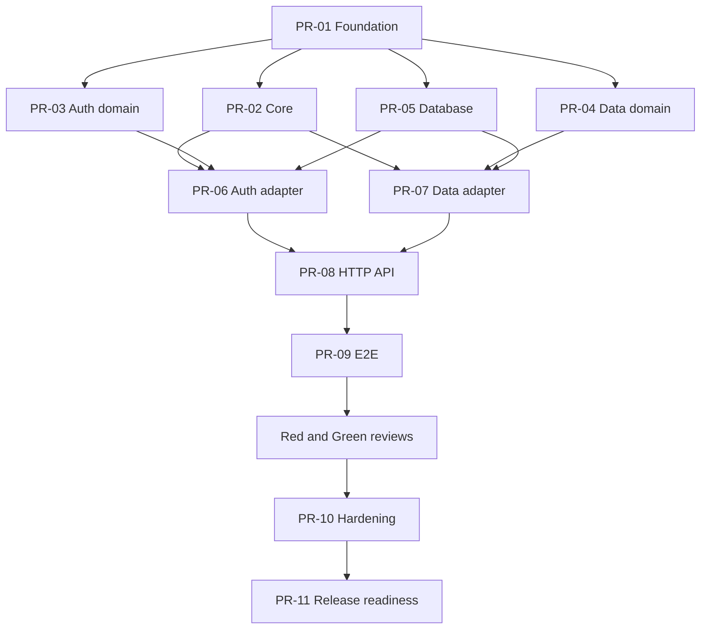

# microJBase v0.1 Implementation Plan

This is the execution queue for building v0.1 with Hermes, OpenCode/Kimi, Grok reviewers, and a human/AI integrator.

The GitHub issues are work orders. An implementation agent creates a branch and pull request only when it starts an issue. Empty pull requests are not pre-created because they become stale, hide dependency changes, and encourage agents to work from old versions of `master`.

## Roles

| Role | Default | Responsibility |
|---|---|---|
| Architect/integrator | ChatGPT/Codex | Own contracts, sequence work, review every PR, approve merges |
| Primary implementation | Hermes → OpenCode → Kimi 2.7 | Implement one bounded issue and supply evidence |
| Adversarial review | Grok Red | Find security and abuse cases with reproduction steps |
| Compliance review | Grok Green | Check scope, architecture, tests, migrations, and regression risk |
| Lightweight work | Sol Light | Mechanical setup, documentation, and tightly specified fixes |

Sol Light may implement PR-02 or documentation portions of PR-11. Auth, RLS, database adapters, security fixes, and final integration require Kimi plus Grok review and integrator approval.

## Global workflow

For every issue:

1. Confirm all prerequisite PRs are merged.
2. Pull the latest `master`.
3. Create the branch named in the issue.
4. Read `AGENTS.md` and all documents it requires.
5. Change only the owned paths named in the issue.
6. Run the required checks and record exact results.
7. Open a PR using the prescribed title and include `Closes #<issue>`.
8. Request the required Grok review lane.
9. Address confirmed findings without expanding scope.
10. Wait for integrator approval; implementation agents never merge their own PRs.

Every PR description must include:

- issue and scope;
- files changed;
- design choices within the existing contracts;
- tests added;
- exact commands and results;
- security considerations;
- dependencies added and why;
- known limitations or blockers.

## Merge policy

- No direct pushes to `master` after implementation begins.
- One issue, one branch, one PR.
- Branches start after their prerequisites are merged; avoid long-lived speculative branches.
- Required checks must pass before review.
- Critical/high security findings block merging.
- Contract or architecture changes require a separate integrator decision before implementation continues.
- Never weaken RLS, runtime-role checks, validation, or tests merely to obtain green CI.

## Wave 1 — Foundation

Wave 1 is sequential and unlocks every other task.

### PR-01 — Project skeleton, contracts, and CI

- Branch: `build/01-project-skeleton`
- Owner: Kimi 2.7
- Review: Grok Green, then integrator
- Dependencies: none
- Paths: root project configuration, `.github/workflows/**`, `src/contracts/**`, `src/main.ts`, source/test directory skeleton, local development configuration
- Outcome: a clean Node 22/TypeScript project whose build, typecheck, lint, and placeholder tests pass

No feature logic belongs in this PR.

## Wave 2 — Parallel module cores

All four PRs branch independently from `master` after PR-01 merges. They must not edit one another's owned directories.

### PR-02 — Core configuration, errors, and lifecycle

- Branch: `feat/02-core-runtime`
- Owner: Sol Light or Kimi 2.7
- Review: Grok Green, then integrator
- Dependencies: PR-01
- Paths: `src/core/**`, matching unit tests, `.env.example` only if PR-01 leaves documented placeholders
- Outcome: validated startup configuration, stable application errors, redaction helpers, and lifecycle primitives

### PR-03 — Authentication domain

- Branch: `feat/03-auth-domain`
- Owner: Kimi 2.7
- Review: Grok Red and Grok Green, then integrator
- Dependencies: PR-01
- Paths: `src/auth/**`, auth unit tests
- Outcome: email/password rules, Argon2id, opaque token creation/hashing, and auth service behaviour against fake repositories

This PR must not import `pg` or Fastify.

### PR-04 — Data domain

- Branch: `feat/04-data-domain`
- Owner: Kimi 2.7
- Review: Grok Green, then integrator
- Dependencies: PR-01
- Paths: `src/data/**`, data unit tests
- Outcome: table-alias resolution, pagination/value validation, and CRUD service behaviour against fake repositories

This PR must not construct SQL or import `pg` or Fastify.

### PR-05 — PostgreSQL foundation and migrations

- Branch: `feat/05-database-foundation`
- Owner: Kimi 2.7
- Review: Grok Red and Grok Green, then integrator
- Dependencies: PR-01
- Paths: `src/database/pool.ts`, `src/database/transaction.ts`, migration runner files, `migrations/**`, database integration tests
- Outcome: restricted pool lifecycle, advisory-locked forward migrations, auth schema, role-safety checks, and transaction-local identity helper

This PR must prove that `microjbase.user_id` cannot leak between pooled requests.

## Wave 3 — PostgreSQL adapters

PR-06 and PR-07 may run in parallel after their listed dependencies merge. They own different adapter files and tests.

### PR-06 — Authentication PostgreSQL adapter

- Branch: `feat/06-auth-postgres-adapter`
- Owner: Kimi 2.7
- Review: Grok Red and Grok Green, then integrator
- Dependencies: PR-02, PR-03, PR-05
- Paths: `src/database/auth-repository.ts`, auth repository integration tests
- Outcome: atomic user/session registration, login lookup, session creation/resolution/revocation, safe conflict translation, and secret-safe errors

### PR-07 — Table registry, CRUD adapter, and RLS proof

- Branch: `feat/07-data-postgres-adapter`
- Owner: Kimi 2.7
- Review: Grok Red and Grok Green, then integrator
- Dependencies: PR-02, PR-04, PR-05
- Paths: `src/database/table-registry.ts`, `src/database/data-repository.ts`, example application migration, data integration tests
- Outcome: verified allowlist metadata, safe identifiers, parameterised CRUD, supported JSON conversion, forced-RLS startup checks, and Alice/Bob isolation tests

SQL-injection and pooled-identity-leak tests are mandatory.

## Wave 4 — HTTP integration

Wave 4 is sequential because its PRs integrate shared server and route wiring.

### PR-08 — Complete HTTP API

- Branch: `feat/08-http-api`
- Owner: Kimi 2.7
- Review: Grok Red and Grok Green, then integrator
- Dependencies: PR-02 through PR-07
- Paths: `src/http/**`, `src/main.ts`, HTTP-focused tests
- Outcome: health, auth, and data routes; bearer handling; response envelopes; request limits; safe error mapping; bounded auth rate limiting; graceful start/stop wiring

The public behaviour must match `docs/api-spec.md` exactly.

### PR-09 — End-to-end acceptance suite

- Branch: `test/09-e2e-acceptance`
- Owner: Kimi 2.7 or dedicated test agent
- Review: Grok Green, Grok Red for negative security paths, then integrator
- Dependencies: PR-08
- Paths: `tests/e2e/**`, test fixtures/helpers, test scripts only where required
- Outcome: automated clean-database proof-of-life flow plus malformed input, expiry/logout, RLS isolation, body limits, database loss, restart persistence, and graceful shutdown coverage

Production code changes require explicit integrator approval and should normally be returned to the owning module instead.

## Wave 5 — Hardening and release

### Review gate — Grok Red

Review the merged Wave 1–4 code for auth bypass, session leakage, enumeration, SQL injection, unsafe identifiers, RLS bypass, connection-pool identity leakage, proxy trust, secret logging, and denial-of-service paths. Findings require severity, evidence, reproduction, and smallest safe correction.

### Review gate — Grok Green

Audit implementation against every scope, architecture, contract, API, database, and testing document. Re-run clean migrations and all checks. Identify missing acceptance evidence, unnecessary dependencies, cross-module imports, and documentation drift.

### PR-10 — Resolve verified review findings

- Branch: `fix/10-security-hardening`
- Owner: Kimi 2.7
- Review: both Grok bots, then integrator
- Dependencies: PR-09 and both review gates
- Paths: only files named by accepted findings
- Outcome: all critical/high findings fixed; medium/low findings fixed or explicitly dispositioned; complete regression suite green

Do not start PR-10 until the integrator has classified and placed findings on its issue.

### PR-11 — Deployment, footprint, and release evidence

- Branch: `release/11-v0.1-readiness`
- Owner: Kimi 2.7; Sol Light may handle documentation-only portions
- Review: Grok Green, then integrator
- Dependencies: PR-10
- Paths: deployment examples, scripts, benchmark documents, operational documentation, release checklist
- Outcome: reproducible systemd/reverse-proxy deployment, backup/restore and upgrade instructions, startup/RSS/load measurements, full release checks, and v0.1 release notes

The version tag is created only after this PR merges and the integrator completes final verification.

## Dependency graph

## Coordinator checkpoints

The integrator pauses the queue after each wave to:

1. verify merged code against the repository contracts;
2. run or inspect the full available test suite;
3. check dependency and footprint growth;
4. update issue prerequisites if implementation revealed a real constraint;
5. explicitly unlock the next wave.

Agents may prepare analysis for blocked issues, but they must not create implementation branches from pre-prerequisite code.
